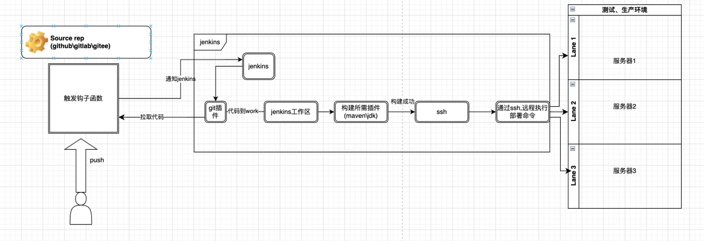

### 使用docker maven插件制作springboot镜像


***因为使用M1电脑中间遇到了很多问题,下面会记录遇到的问题***

- maven 构建镜像配置

pom.xml 文件添加docker插件<br>
***一开始使用com.spotify插件,会出现下面现象***
-----
  错误：

引起原因：com.spotify.docker.client.shaded.javax.ws.rs.ProcessingException：java.lang.UnsatisfiedLinkError：无法加载 FFI 提供程序 jnr.ffi.provider.jffi.Provider

引起：java.lang.UnsatisfiedLinkError：java.lang.UnsatisfiedLinkError：/private/var/folders/hz/rgppp8250rsdp86kf_tfjvqw0000gp/T/jffi8502916075702391528.dylib：dlopen(/private/var/folders/hz/rgppp8250rs dp86kf_tfjvqw0000gp/T/jffi8502916075702391528.dylib ，0x0001）：尝试：'/private/var/folders/hz/hz/rgppp8250rsdp86kf_tf_tfjvqw0000gp/t/jffi850291602916075702391528.dylib' /lib/jffi8502916075702391528.dylib'（没有这样的文件）

---
参考:https://stackoverflow.com/questions/71300031/docker-image-build-failed-on-mac-m1-chip  <br>
另外com.spotify插件已经不再维护了
后来使用io.fabric8 maven插件
但是低版本已经会出现这个问题
使用最新的0.43.4解决了这个问题
```
<build>
        <plugins>
            <plugin>
                <groupId>io.fabric8</groupId>
                <artifactId>docker-maven-plugin</artifactId>
                <version>0.43.4</version>
                <configuration>
                    <dockerHost>unix:///Users/mac_1/.docker/run/docker.sock</dockerHost>
                    <registry>${registry.host}</registry>
                    <authConfig>
                        <username>${registry.username}</username>
                        <password>${registry.password}</password>
                    </authConfig>
                    <images>
                        <image>
                            <name>${registry.host.name}/${docker.project.build.finalName}:${buildVersion}</name>
                            <registry>${registry.host}</registry>
                            <build>
                                <dockerFile>${project.basedir}/Dockerfile</dockerFile>
                            </build>
                        </image>
                    </images>
                </configuration>
            </plugin>
        </plugins>
    </build>
```

- 添加dockerfile文件

再pom同级目录添加dockerfile文件

```
# 基础镜像
FROM java:8
# 作者信息
MAINTAINER "DS"
# 添加一个存储空间
VOLUME /tmp
# 暴露8080端口
EXPOSE 8080
ARG JAR_FILE=target/spring-boot-docker.jar
# 往容器中添加jar包
ADD ${JAR_FILE} app.jar

# 启动镜像自动运行程序
ENTRYPOINT ["java","-Djava.security.egd=file:/dev/urandom","-jar","/app.jar"]
```
之后执行
mvn package (打jar包)<br>
docker build (制作镜像)<br>
docker pull (推镜像到私有仓库)<br>

***其中<registry>${registry.host}</registry>中的registry.host
是使用docker-registry ,官方提供的工具，可以用于构建私有的镜像仓库。
```
docker run -d  -p 5000:5000 -v /Users/mac_1/data/docker/registry:/var/lib/registry  registry
```

###  Jenkins + Docker + Github 实现自动化部署 Maven 项目



#### 安装Jenkins

##### 1、docker安装jenkins

```
docker run --hostname=b50b06a2b5c3 --user=root --mac-address=02:42:ac:11:00:02 --env=LANG=C.UTF-8 --env=JENKINS_HOME=/var/jenkins_home --env=JENKINS_SLAVE_AGENT_PORT=50000 --env=PATH=/opt/java/openjdk/bin:/usr/local/sbin:/usr/local/bin:/usr/sbin:/usr/bin:/sbin:/bin --env=JENKINS_VERSION=2.435 --env=JENKINS_UC=https://updates.jenkins.io --env=JENKINS_INCREMENTALS_REPO_MIRROR=https://repo.jenkins-ci.org/incrementals --env=REF=/usr/share/jenkins/ref --env=COPY_REFERENCE_FILE_LOG=/var/jenkins_home/copy_reference_file.log --env=JENKINS_UC_EXPERIMENTAL=https://updates.jenkins.io/experimental --env=JAVA_HOME=/opt/java/openjdk --volume=/Users/mac_1/data/docker/jenkins/home:/var/jenkins_home --volume=/run/host-services/docker.proxy.sock:/var/run/docker.sock --volume=/Users/mac_1/data/docker/jenkins/software:/var/software --volume=/var/jenkins_home --privileged -p 9091:50000 -p 9090:8080 --restart=always --label='org.opencontainers.image.description=The Jenkins Continuous Integration and Delivery server' --label='org.opencontainers.image.licenses=MIT' --label='org.opencontainers.image.revision=5ef64f1eb4b16ba4640d8a4bedca7ac660aec41a' --label='org.opencontainers.image.source=https://github.com/jenkinsci/docker' --label='org.opencontainers.image.title=Official Jenkins Docker image' --label='org.opencontainers.image.url=https://www.jenkins.io/' --label='org.opencontainers.image.vendor=Jenkins project' --label='org.opencontainers.image.version=2.435' --runtime=runc -t -d jenkins/jenkins:jdk11
```
***上面需要注意的点*** <br>
1、挂载jenkins目录 --volume=/Users/mac_1/data/docker/jenkins/home:/var/jenkins_home  --volume=/Users/mac_1/data/docker/jenkins/software:/var/software <br>
2、挂载docker目录(容器内连接宿主机docker server)   --volume=/run/host-services/docker.proxy.sock:/var/run/docker.sock <br>
##### 2、jenkins容器安装docker客户端
```
apt-get update
apt-get install -y docker.io
```


##### 2、配置jenkins
参考文档: https://juejin.cn/post/7127302949797101604#heading-8 <br>
参考文档: https://segmentfault.com/a/1190000014325300 <br>

docker-registry参考文档:https://yeasy.gitbook.io/docker_practice/repository/registry <br>
docker fabric8 maven插件参考文档: https://blog.lonelyman.site/archives/35 <br>
fabric8官方文档:https://dmp.fabric8.io/ <br>
docker官方文档:https://docs.docker.com/guides/get-started/ <br>
dockerFile :https://docs.docker.com/engine/reference/builder/


